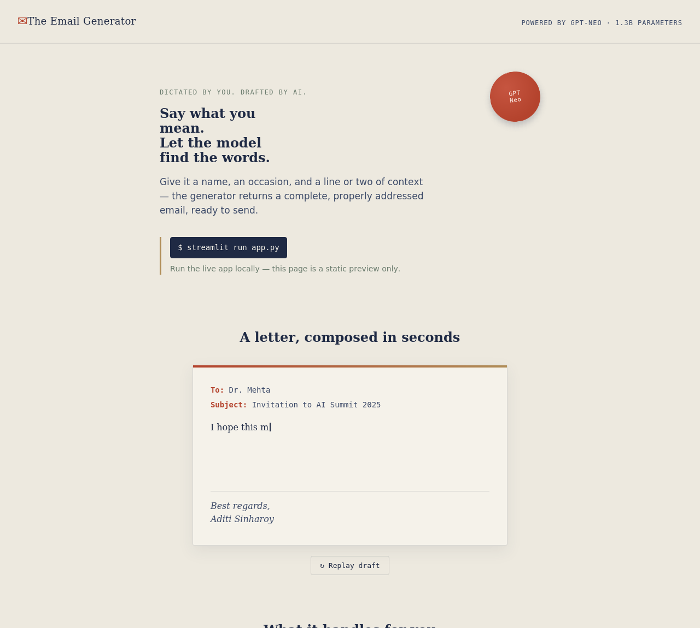
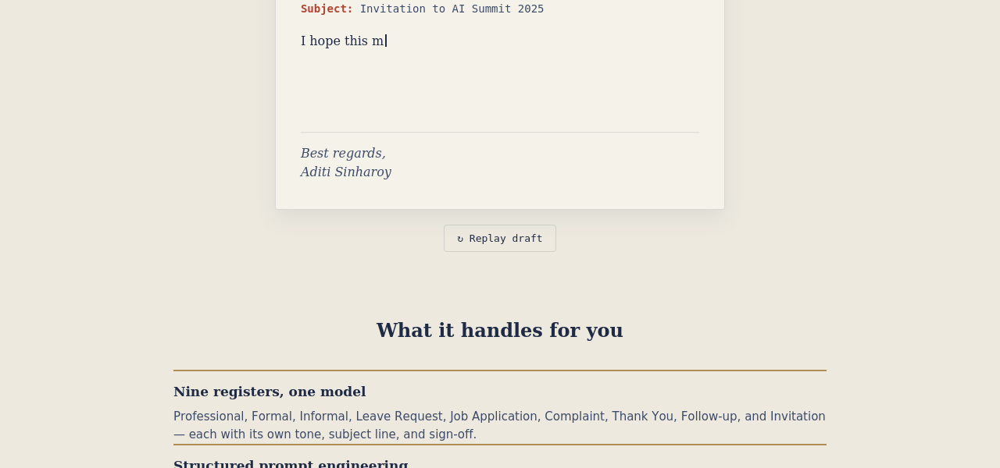
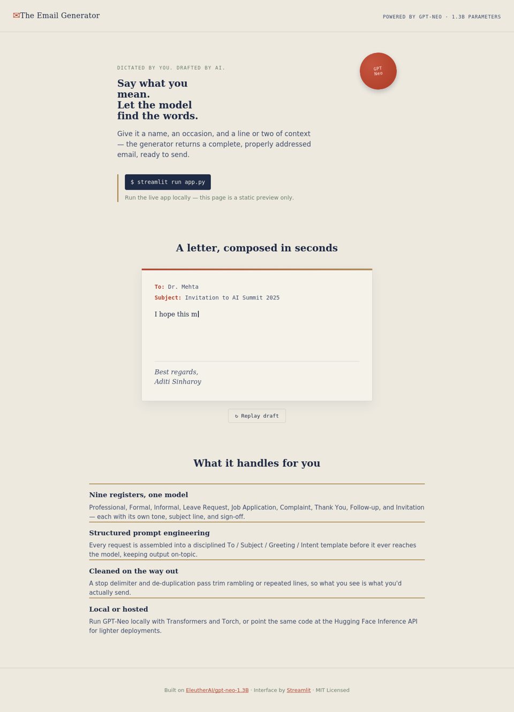

# 📧 Personalized Email Generator using GPT-Neo

[](https://www.python.org/)
[](https://streamlit.io/)
[](https://huggingface.co/)
[](LICENSE)

An AI-powered application that generates professional, personalized emails using **GPT-Neo (1.3B)** and **Streamlit**. Simply provide the recipient, email type, subject, and a brief context, and the model creates a complete, context-aware email in seconds.

## 🚀 Live Demo

👉 **Try it here:**

**https://email-generator-using-gpt-neo-p5xpprpb2ozu789z3jcsfe.streamlit.app/**

No installation required—open the link and start generating emails instantly.

---

> Built as an NLP and Generative AI project using **GPT-Neo (EleutherAI)** with prompt engineering, Hugging Face Transformers, and Streamlit.
## ⚡ Quick Start

### Option 1 — Use the Live Demo

Open the deployed application:

**https://email-generator-using-gpt-neo-p5xpprpb2ozu789z3jcsfe.streamlit.app/**

### Option 2 — Run Locally

```bash
git clone https://github.com/<your-username>/Email-Generator.git

cd Email-Generator

pip install -r requirements.txt

streamlit run app.py
```
# 📧 Personalized Email Generator using GPT-Neo

An AI-powered tool that drafts complete, professional emails from just a
handful of details — recipient, occasion, and a line of context — using
**GPT-Neo (1.3B)**, an open-source transformer language model from
EleutherAI, wrapped in a clean **Streamlit** interface.

> Built from the original project report *"Personalized Email Generator
> using GPT-Neo"* (VIT, July 2025) and re-engineered into a modular,
> production-ready codebase.

---

## Abstract

Drafting professional emails consistently is time-consuming, especially
for people who send similar messages repeatedly or aren't confident in
formal writing. This project automates that process using Natural
Language Processing: the user supplies a recipient, an event/subject, and
optional extra details, and GPT-Neo (1.3B) generates a complete,
grammatically sound, contextually relevant email. A structured
prompt-engineering scheme (`To: / Subject: / Dear ... ,` plus a stop
delimiter) keeps the model's output focused, and an output-cleaning pass
removes repetition and trims irrelevant trailing text. The result is
wrapped in a simple, accessible Streamlit UI so the tool requires no
programming knowledge to use.

---

## Features

- ✍️ **Nine email types** — Professional, Formal, Informal, Leave Request,
  Job Application, Complaint, Thank You, Follow-up, and Invitation —
  each with its own tone, subject prefix, and sign-off.
- 🧠 **GPT-Neo 1.3B** text generation, tunable via temperature, top-k,
  top-p, and repetition penalty.
- 🧩 **Structured prompt engineering**, isolated in its own module
  (`src/prompt_templates.py`).
- 🧹 **Output cleaning** — truncates at a stop delimiter, removes
  duplicate lines, and collapses excess whitespace.
- ✅ **Input validation** with clear, actionable error messages.
- 🔐 **Secure configuration** — every tunable value and secret is loaded
  from environment variables via `.env`; nothing is hardcoded.
- ⚡ **Two execution backends** — run GPT-Neo locally, or call the Hugging
  Face Inference API for lightweight deployments.
- 💾 **Download generated emails** as `.txt` directly from the UI.
- 🖥️ Clean, responsive Streamlit interface with a live prompt preview.

---

## Technologies Used

| Category      | Tools / Libraries                                   |
|---------------|------------------------------------------------------|
| Language      | Python 3.10+                                          |
| Model         | GPT-Neo 1.3B (`EleutherAI/gpt-neo-1.3B`)              |
| ML Libraries  | Hugging Face Transformers, PyTorch, Accelerate        |
| Interface     | Streamlit                                             |
| Config        | python-dotenv                                         |
| HTTP (API mode)| requests                                             |
| Testing       | pytest                                                |
| IDE           | Visual Studio Code                                    |

---

## Architecture

```
User Input (Streamlit form)
        │
        ▼
 Input Validation  ──────►  src/validators.py
        │
        ▼
 Prompt Engineering ─────►  src/prompt_templates.py
        │
        ▼
 GPT-Neo Generation ─────►  src/llm.py  (local model or HF Inference API)
        │
        ▼
 Output Cleaning ────────►  src/utils.py
        │
        ▼
 Rendered Email  (Streamlit UI, with download button)
```

See [`docs/architecture.md`](docs/architecture.md) for the full design
write-up, including caching strategy and extensibility notes.

---

## Folder Structure

```
Email-Generator/
│
├── app.py                     # Streamlit application entry point
├── requirements.txt
├── README.md
├── LICENSE
├── .gitignore
├── .env.example
│
├── src/
│   ├── email_generator.py     # Orchestration layer
│   ├── prompt_templates.py    # Prompt engineering for all email types
│   ├── llm.py                 # GPT-Neo model wrapper (local + Inference API)
│   ├── utils.py                # Output cleaning helpers
│   ├── config.py               # Centralized environment-based configuration
│   └── validators.py           # Input validation
│
├── templates/
│   └── index.html              # Static preview/landing page
│
├── static/
│   ├── css/style.css
│   ├── js/script.js
│   └── images/logo.svg
│
├── screenshots/
│   ├── home.png
│   ├── generated_email.png
│   └── ui.png
│
├── examples/
│   ├── formal_email.txt
│   ├── casual_email.txt
│   ├── complaint_email.txt
│   ├── leave_request.txt
│   └── job_application.txt
│
└── docs/
    └── architecture.md
```

---

## Installation

```bash
# 1. Clone the repository
git clone https://github.com/<your-username>/Email-Generator.git
cd Email-Generator

# 2. Create and activate a virtual environment
python -m venv venv
source venv/bin/activate        # Windows: venv\Scripts\activate

# 3. Install dependencies
pip install -r requirements.txt

# 4. Copy the environment template
cp .env.example .env
```

> **Note:** The first run will download the GPT-Neo 1.3B model
> (~5 GB) from Hugging Face. Make sure you have sufficient disk space
> and a stable internet connection, or switch to Inference API mode
> (see below).

---

## Environment Variables

All configuration is read from `.env` (see `.env.example` for the full,
documented list). Key variables:

| Variable                    | Description                                                   | Default                     |
|------------------------------|----------------------------------------------------------------|------------------------------|
| `MODEL_NAME`                 | Hugging Face model id                                          | `EleutherAI/gpt-neo-1.3B`    |
| `TOKENIZER_NAME`              | Hugging Face tokenizer id                                      | `EleutherAI/gpt-neo-1.3B`    |
| `USE_INFERENCE_API`           | `true` to use the HF Inference API instead of a local model     | `false`                      |
| `HUGGINGFACEHUB_API_TOKEN`    | Required if `USE_INFERENCE_API=true`. **Never commit this.**    | *(empty)*                    |
| `MAX_NEW_TOKENS`              | Max tokens generated per email                                 | `200`                        |
| `TEMPERATURE`                 | Sampling temperature                                            | `0.9`                        |
| `TOP_K` / `TOP_P`             | Nucleus / top-k sampling parameters                              | `50` / `0.95`                 |
| `REPETITION_PENALTY`          | Penalizes repeated tokens                                        | `1.3`                        |
| `STOP_DELIMITER`              | Delimiter used to truncate model output                          | `---`                        |
| `DEVICE`                      | `auto`, `cpu`, or `cuda`                                         | `auto`                       |

No API key is required for the default (local) mode — GPT-Neo runs
entirely on your machine. An API token is only needed if you opt into
Inference API mode, and it is always loaded from `.env`, never hardcoded.

---

## How to Run

```bash
streamlit run app.py
```

Then open the URL Streamlit prints (typically `http://localhost:8501`)
in your browser.

To preview the static landing page (no backend, no model) instead:

```bash
open templates/index.html   # macOS
# or just double-click templates/index.html in your file browser
```

---

## Usage

1. Enter the **recipient's name**.
2. Choose an **email type** (Professional, Invitation, Complaint, etc.).
3. Enter the **event / subject** of the email.
4. Optionally add **extra instructions** or context.
5. Optionally enter **your name** to sign off with.
6. Click **✉️ Generate Email**.
7. Review the generated email, download it as `.txt`, or inspect the
   exact prompt sent to GPT-Neo via the expandable panel.

---

## Screenshots

| Home / Overview | Generated Email | Full Interface |
|---|---|---|
|  |  |  |

*The screenshots above are rendered from the static preview page
(`templates/index.html`) included in this repo. The live Streamlit
app (`app.py`) shares the same visual language — run it locally to see
the interactive form and generation flow in action.*

---

## Example Prompts

Input collected from the UI is compiled into a structured prompt, e.g.:

```
To: Dr. Mehta
Subject: Invitation to AI Summit 2025

Dear Dr. Mehta,
I hope this message finds you well.
I am delighted to invite you to AI Summit 2025. It will start at 10 AM
and feature sessions on Responsible AI.
```

See [`src/prompt_templates.py`](src/prompt_templates.py) for the full
prompt-construction logic across all nine email types.

---

## Example Outputs

Full worked examples (input → generated email) for five email types are
included in [`examples/`](examples/):

- [`examples/formal_email.txt`](examples/formal_email.txt)
- [`examples/casual_email.txt`](examples/casual_email.txt)
- [`examples/complaint_email.txt`](examples/complaint_email.txt)
- [`examples/leave_request.txt`](examples/leave_request.txt)
- [`examples/job_application.txt`](examples/job_application.txt)

---

## Future Improvements

- 🌐 Multilingual email generation.
- 🎚️ User-selectable tone slider (formal ↔ casual) independent of email type.
- 📤 Direct sending via Gmail/Outlook integration.
- 🧵 Multi-turn refinement ("make it shorter", "make it more assertive").
- 🗃️ Saved templates and history per user.
- 🔄 Swap in larger or fine-tuned models for higher-quality output.

---

## 👩‍💻 Author

**Shaik Salma**

B.Tech Computer Science Engineering (AI & ML)

VIT-AP University

GitHub: https://github.com/<your-username>

LinkedIn: https://linkedin.com/in/<your-profile>


*Vellore Institute of Technology — Project submitted 5th July 2025.*

---

## License

Released under the [MIT License](LICENSE).
